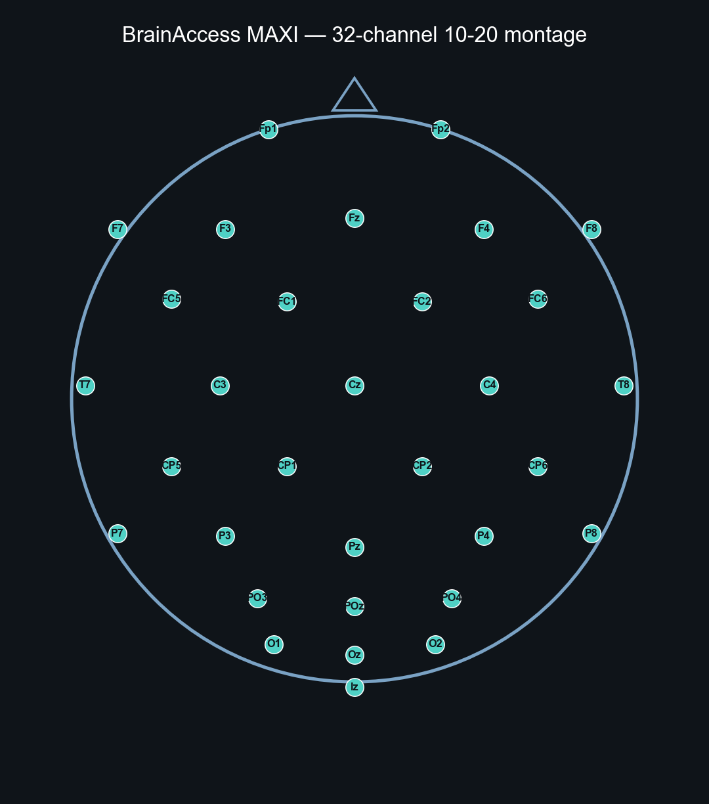
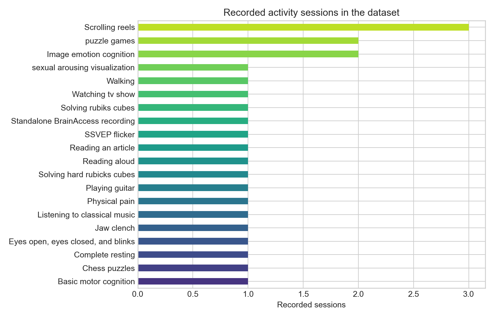
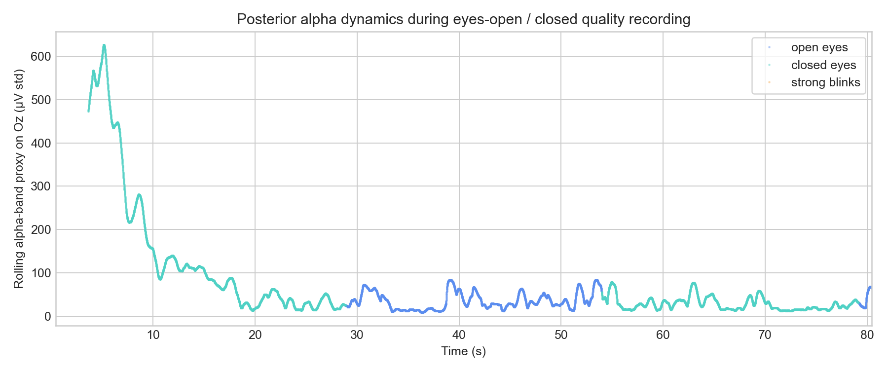
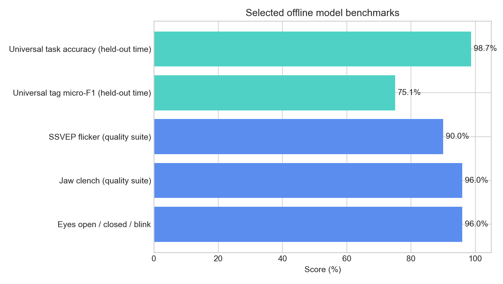

# Brain Visualization EEG Helmet

Experimental research codebase for recording, analyzing, and visualizing EEG from a **BrainAccess MAXI** dry-electrode helmet. The project streams 32-channel 10-20 EEG at 250 Hz, runs quality and cognition experiments, trains task-specific classifiers, and builds a learned **universal brain-state representation** used for real-time 3D trajectory visualization and generative piano music.

> **Disclaimer:** This is research software, not a medical device. EEG recordings and model outputs are experimental signals — not clinical diagnoses, emotion measurements, or health assessments.

## Hardware

| | |
|---|---|
| **Device** | BrainAccess MAXI (`BA MAXI 034`) |
| **Channels** | 32 EEG electrodes, international 10-20 layout |
| **Sample rate** | 250 Hz |
| **Reference / bias** | Bias on `Iz` (configurable in stream wrapper) |
| **Gain** | X8 |
| **SDK** | BrainAccess Python SDK 3.6.x |

The stream wrapper lives in `eeg_quality_suite/brainaccess_stream.py` and handles device scan, channel enablement, chunk callbacks, and timestamp alignment.



## What we are building

This repository combines low-level EEG infrastructure with several cognition experiments and two creative front-ends:

1. **Quality suite** — SSVEP flicker, eyes open/closed/blink, jaw clench, and stream-stability protocols with simple ML predictors (~90–96% window-level accuracy on sanity-check recordings).
2. **Task experiments** — motor imagery, concentration baseline, box-motion imagery, and passive image-emotion viewing (EmoSet).
3. **Universal brain-state encoder** — a 160-dimensional spatiotemporal representation trained on 22 labeled naturalistic sessions with 37 neurofunctional tags (reading, resting, scrolling reels, chess, guitar, pain, etc.).
4. **Live visualization** — real-time 3D manifold trajectory with smoothed multi-label tag predictions (`brain_state_representation/realtime_brain_state.py`).
5. **Brain State Sonata** — deterministic piano composition driven by manifold coordinates and latent dynamics (`brain_music/`).
6. **Universal recorder** — tagged free-form activity recording and dataset cataloging (`universal_brain_recorder/`).

### Learned brain-state manifold

The universal model fuses causal 2 / 4 / 8-second windows through a channel-aware graph encoder, then projects embeddings into a smooth 2D or 3D map for visualization. The plot below shows ~25k temporally ordered windows from all training sessions.


### Recorded activities

Sessions span structured lab protocols and everyday activities: quality checks, motor imagery, emotion images, Instagram reels, TV, classical music, Rubik's cubes, chess puzzles, reading, walking, guitar, and more.



### Signal quality example

Posterior alpha on `Oz` rises during eyes-closed segments relative to eyes-open baseline — a basic sanity check that occipital dynamics are visible in the data.



### Offline benchmarks

| Benchmark | Score |
|---|---:|
| Eyes open / closed / blink | 96.0% |
| Jaw clench (quality suite) | 96.0% |
| SSVEP flicker (quality suite) | 90.0% |
| Universal tag micro-F1 (held-out time) | 75.1% |
| Universal task accuracy (held-out time) | 98.7% |



Window-level metrics on overlapping segments are optimistic; held-out session validation is limited because most tasks appear in only one recording day. See `brain_state_representation/UNIVERSAL_MODEL_REPORT.md` for honest interpretation.

## Project layout

```
Brainz/
├── eeg_quality_suite/          # Streaming, quality protocols, simple predictors
├── basic_motor_cognition/      # Motor imagery record / train / infer
├── concentration_baseline/     # Concentrated vs not-concentrated
├── box_motion_cognition/       # Imagined box motion (up/down/left/right)
├── image_emotion_cognition/    # Passive EmoSet image viewing
├── brain_state_representation/ # Universal encoder, map, live visualization
├── brain_music/                # Real-time piano sonata from brain state
├── universal_brain_recorder/   # Tagged free-form recording + labeling
├── brain_visualize/            # 3D brain surface + electrode viz
├── sessions/                   # Raw EEG sessions (not in git — see .gitignore)
├── recordings/                 # Legacy baselines and quality reports
└── docs/images/                # README figures
```

## Quick start

Use the conda environment `python311`:

```powershell
$python = "C:\Users\diego\anaconda3\envs\python311\python.exe"
$project = "D:\Brainz"
Set-Location $project
```

**Stream quality diagnostic**

```powershell
& $python .\eeg_quality_suite\13_diagnose_stream_quality.py
```

**Train universal brain-state model and build map**

```powershell
& $python .\brain_state_representation\train_universal_model.py
& $python .\brain_state_representation\build_brain_state_map.py
```

**Live visualization (helmet required)**

```powershell
& $python .\brain_state_representation\realtime_brain_state.py
```

**Replay brain music without hardware**

```powershell
& $python .\brain_music\replay_brain_music.py
```

Scripts are constant-driven — edit top-level variables in each file rather than passing CLI arguments. See `AGENTS.md` for full protocol details, data layout, and training constants.

## Data and privacy

- Raw EEG sessions live under `sessions/` and are excluded from git (sensitive biometric data).
- Model weights (`.pt`, `.pkl`, `.joblib`) are also gitignored; metrics JSON files are kept.
- Copy API keys into a local `.env` file; never commit secrets.

## Regenerating README figures

```powershell
& $python .\docs\generate_readme_assets.py
```

## License and ethics

Get explicit consent before recording EEG. Do not upload raw sessions or identifiable metadata without permission. Stop immediately if a participant reports discomfort, dizziness, or photosensitivity (especially during SSVEP flicker protocols).
