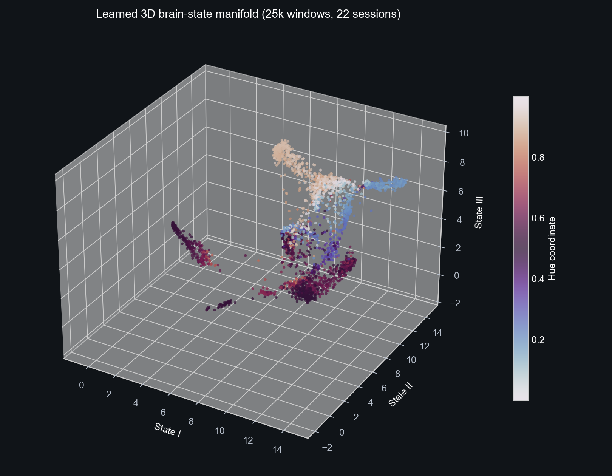

# Brainz: EEG experiments and creative tools

Brainz is a collection of experiments built around a BrainAccess MAXI 32-channel EEG headset. It includes streaming and signal-quality utilities, task-specific recording and analysis, an exploratory brain-state representation, live visual and music demos, and an experimental EEG-to-Arduino lamp controller.



The work is exploratory and currently based on one participant. It is not a medical device, a diagnostic tool, or a reliable way to infer a person's emotions, intentions, or mental state.

## Hardware and runtime

The streaming code targets a BrainAccess MAXI (`BA MAXI 034`) with 32 channels in the international 10-20 layout, sampled at 250 Hz. The stream wrapper configures the BrainAccess SDK, channel selection, gain, bias, and chunk timing. Most recording and training scripts are constant-driven: edit the settings near the top of a script and run it from the project directory.

Use the `python311` Conda environment configured in `AGENTS.md`. A compatible BrainAccess SDK and the headset are required for live acquisition. Saved-data visualization or analysis may have different requirements, described by the relevant project README. No command-line arguments are required by the experiment scripts.

```powershell
$python = "C:\Users\diego\anaconda3\envs\python311\python.exe"
Set-Location "D:\Brainz"
```

## What is here

| Area | Contents | Current evidence and limits |
|---|---|---|
| `eeg_quality_suite/` | Stream diagnostics and eyes-open/closed, blink, jaw-clench, and SSVEP protocols | Stored-session sanity checks show high window-level scores on some simple contrasts. They do not establish generalization to other people or sessions. |
| `basic_motor_cognition/`, `concentration_baseline/`, `box_motion_cognition/` | Recording, feature extraction, model training, and live inference experiments | These are prototypes. The archived five-class motor-imagery result is very poor (about 3% accuracy); it does not decode movement intention reliably. |
| `image_emotion_cognition/` | EEG-only experiments for passive viewing of emotion-labeled images | The archived two-session result is weak: about 22% accuracy across eight classes, with only 236 windows. It is not evidence that EEG can identify someone's emotion. |
| `brain_state_representation/` | Multi-scale EEG encoder, temporal map, offline probes, and live visualization | A research prototype trained on 22 sessions from one participant. Held-out-time scores are not held-out-person results; session information remains strongly decodable and the stated invariance gate fails. See [the model report](brain_state_representation/UNIVERSAL_MODEL_REPORT.md). |
| `brain_music/` | Live and replayable piano composition driven by the learned state map | A creative mapping demo. The generated music is not a validated interpretation of brain activity. See [Brain State Sonata](brain_music/README.md). |
| `jedi_lamp_control/`, `mind_control_hardware/` | Experimental classifier and Arduino relay sketches for a deliberate lamp-toggle ritual | A prototype demonstration, not dependable assistive control. Follow the electrical-safety notes in [the experiment guide](jedi_lamp_control/README.md). |
| `universal_brain_recorder/` | Tagged task recording, event annotation, session metadata, and dataset cataloging | Raw streams and session metadata are private local data and are excluded from this repository. See [the recorder guide](universal_brain_recorder/README.md). |
| `brain_visualize/` | 3D brain and electrode visualization utilities | Visualization helpers and reference assets. |

Other folders contain early experiments, device reference images, and generated figures for this README. `BrainAccessBoard/` is vendor software kept locally and is not part of the Git repository.

## Quick start

Run commands from `D:\Brainz` in the configured environment. The following command reads the latest saved quality sessions; live recording scripts require the headset and may create sensitive EEG data under ignored local folders.

```powershell
& $python .\eeg_quality_suite\13_diagnose_stream_quality.py
```

To explore an existing recorded music demo without connecting the headset:

```powershell
& $python .\brain_music\replay_brain_music.py
```

For the live recorder, task protocols, training settings, and hardware procedures, see [AGENTS.md](AGENTS.md) and the README files inside each subproject. Training is not needed to inspect the source or view the checked-in README figures.

## Figures

The README figures in `docs/images/` show the 32-channel montage, an eyes-open/closed alpha-band sanity check, a recorded-session overview, and exploratory model diagnostics. They are descriptive outputs from this project, not independent validation. The map is produced from model embeddings and should be interpreted alongside the limitations in the model report.

Regenerate figures only when the corresponding local inputs exist. The helper in `docs/generate_readme_assets.py` reads private session catalogs and a local embedding export; those inputs are intentionally not tracked.

## Data and privacy

EEG and session metadata are sensitive biometric and health-adjacent information. The repository ignores raw session folders, legacy recordings, live-run logs, local secrets, model weights, and most derived datasets. Do not force-add participant recordings, metadata, or identifying images. Use consented data and aliases, and keep private session files outside GitHub.

The project does not commit BrainAccess SDK installers, local piano sample libraries, or model weights. Some metrics and plots are checked in to document exploratory results, but their performance is limited by the small, single-participant dataset and correlated windows.

## Safety and ethics

Get explicit consent before recording. Do not use model outputs for medical, diagnostic, emotional, or cognitive decisions. Stop if a participant feels unwell. Flickering SSVEP stimuli may pose a risk for people with photosensitive epilepsy. Never connect exposed mains wiring to a breadboard relay; use an enclosed, correctly rated and isolated module, or test with low voltage.
